# llopis_scraper_books_online.py #

1.  [Description](#description)
2.  [Utilisation](#utilisation)
3.  [Installation](#installation)
    1.  [Environnement virtuel](#environnement-virtuel)
    2.  [Requierements](#requierements)
4.  [À propos](#a-propos)
    1.  [Package](#package)
    2.  [Bugs connus](#bugs-connus)
    3.  [Idées d'améliorations](#idees-d-ameliorations)

## 1. Description  ##

Ce script à été réalisé dans le cadre d'un projet du parcours 'Développeur d'application - Python' d'OpenClassROoms.

llopis_scraper_books_online.py est un outil de scraping utilisable uniquement sur le site [books to scrape](http://books.toscrape.com/), une simulation de librairie en ligne. Il permet de recueillir diverses informations sur les livres, et de les écrire dans un .csv, ainsi que de télécharger les images de couverture des livres.

Pour illustrer, voici le .csv de la catégorie 'Contemporary' contenant 3 livres,\
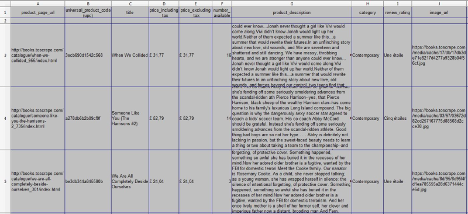\
et les diffentes couvertures récupérées.\
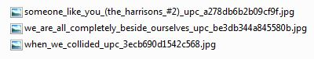

\
Pour chacune des catégorie scraper, le script crée un dossier au nom de la catégorie contenant le .csv et le dossier de couverture des livres. Chacun de ces dossiers sont rangés dans le dossier 'output' du répertoire du script (dossier crée par le script si inexsistant).

Voici à quoi ressemble le dossier 'output' après le scrap des 50 catégories du site,\
\
et le dossier contemporary.\
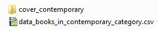

\
Le script affiche sa progression en cours d'éxécution.\
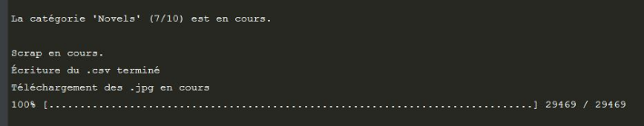

\
**Attention :**
- Le .csv utilise '|' comme séparateur de colonnes.
- Les .csv et la couverture des livres ne sont pas mis à jour en direct.
- Relancer llopis_scraper_books_online.py réécrira le .csv de la catégorie, mais ne retéléchargera pas les couvertures si celles-ci existent déjà. 

## 2. Utilisation  ##

Le script s'utilise à partir d'un terminal, de 4 façons différentes.

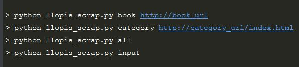
1. L'option 'book' suivit de l'url d'un livre spécifique, pour recueillir les données d'un seul livre.\
Tous les .csv écrits et les couvertures des livres téléchargées via cette option, sont stockés dans le dossier './output/zingle'\
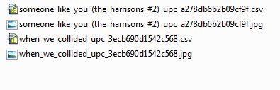

2. L'option 'category', suivit le l'url de la page '/index.html' d'une catégorie, pour recueillir les informations de toutes une catégorie.\
 **Attention**, si la catégorie a plusieurs pages, il faut impérativement renseigner la première page qui finit en '/index.html'
 
3. L'option 'all' pour recueillir les données de tous les livres pour toutes les catégories.

4. L'option input, pour recueillir les données d'une ou plusieurs catégories, via un menu à utiliser dans le terminal. \
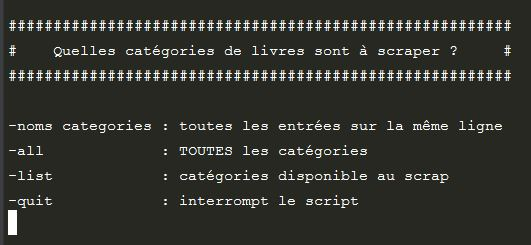\
Via cette option, ont peut sélectionner toutes les catégories du site, ou n'en sélectionner que quelques unes.\
Les .csv et couvertures de livres sont stockés au même endroit.\
La sélection se fait par demande d'input à l'utilisateur.

## 3. Installation  ##

Dans les sous-sections suivantes, les lignes de commande sont exécutée depuis le répertoire de travail :\
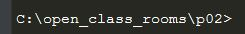\
Les différents fichiers du script s'y trouvent.\
Pour utiliser les lignes de commandes, il faut que votre répertoire de travail, soit, celui où se trouvent les différents fichiers du script.

### i. Environnement virtuel  ###

Sous Windows, avec l'IDE PyCharm.

- Pour créer l'environnement virtuel lancer la commande suivante :\
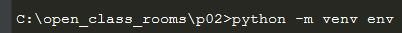\
Cela créra un environement virtuel nommé 'env'

- Si l'environnement virtuel est actif, son nom apparaîtra au début de la ligne de commande, comme suit :\
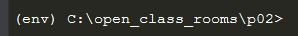

- Sinon, pour activer l'env, il faut lancer la commande :\
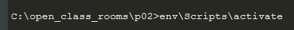

### ii. Requierements  ###

Une fois l'environnement virtuel activé, lancer la commande suivante :\
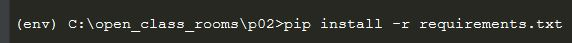\
Cela installera tous les modules renseignés dans le fichier requierements.txt.

## 4. À propos  ###

### i. Package  ###

llopis_scraper_books_online.py utilise un ensemble de modules locals, réunis dans le package scrap_package.

Pour chaque module, une description, sa structure, ses inputs, ses transformations et ses ouputs.

- a_collect_url_home_all_category.py\
\
Ce module sert lors des options 'all' et 'input'. Il récupére les http://category_url/index.html de toutes les catégories de livres présentent sur le site. Le scrap ce fait depuis l'url de page d'accueil du site.\
    - Input : Une constante 'URL_site', qui sert à vérifier que l'url du site est valide.
    - Transformation : Depuis la page d'accueil du site, scrap tous les href commençant par 'catalogue/category/books/', et les utilise pour reconstruire les url en output.
    - Ouput : Les url des catégories type 'http://category_url/index.html'

- b_selection_category_to_scrap.py\
\
Ce module sert à l'option 'input'. Il permet du menu et la sélection des catégories à scraper via des input utilisateur.
    - Input : Les différents choix de l'utilisateur, tels que les catégories à scraper ou la demande d'affichage des catégories disponible.
    - Transformation : Diverses gestions d'erreurs, de manipulations d'input, de messages utilisateur etc…
    - Output : Les url des catégories type 'http://category_url/index.html' que l'utilisateur aura choisit.

- c_scrap_books_urls_in_category.py\
\
Ce module sert au option 'category', 'all' et 'input'. Il permet la collecte de toutes les url des livres d'une catégorie.
    - Input : L'url d'une catégorie (type '/index.html')
    - Transformation : Évalue le nombre de pages que possède la catégorie, selon le nombre de livres qu'elle contient. Contruit les url des autres pages de la catégories. Pour chaque page de la catégorie, récupére les href de tout les h3 de la page. Puis reconstruit les urls des livres.
    - Output : Toutes les url des livres de la catégorie donnée en input.

- d_check_url_books.py\
\
Ce module sert dans toutes les options. Il lance les requests de chacune des url qu'il recoit.
    - Input : L'ensemble des url des livres d'une catégorie (ou l'url du livre renseignée avec l'option 'book').
    - Transformation : Fais une requête pour chaque url. Stocke les responses exploitables et les url des livres correspondants dans des listes distinctes. Il stocke aussi les responses inexploitables.
    - Output : Un message d'erreur indiquant les responses inexploitables. Return les responses exploitables. Return l'ensemble des url des livres exploitables.

- e_scrap_data.py\
\
Ce module sert dans toutes les options. Il scrape l'ensemble des données pour chaque url de livre contenues en input. Le module fait les catégories les unes après les autres, y compris pour l'option 'all' ou 'input'.
    - Input : Toutes les responses exploitables. L'ensemble des url des livres exploitables d'une catégorie (ou l'url du livre et sa response, si l'option 'book' a été utilisée). 
    - Transformation : Crée un dictionnaire vide ayant pour keys les données voulues. Pour chaque url, scrape les informations à différents endroit de la page du livre et les stockent dans le dictionnaire.
    - Output : Le dictionnaire contenant toutes les informations désirées, pour l'ensemble des url de livres contenues en input.

- f_write_csv.py\
\
Ce module sert dans toutes les options. Il écrit le .csv, avec pour en-têtes, les keys du dictionnaire, pour séparateur '|' et pour contenu, l'ensemble des informations pour tous les livres d'une catégorie (ou du livre renseignée avec l'option 'book').
    - Input : Dictionnaire d'une catégorie (ou du livre renseignée avec l'option 'book'). L'option utilisée.
    - Transformation : Détermine la catégorie concernée. Si le dossier './output' n'existe pas, le crée. Recconnait si l'on vient depuis l'option 'book', dans ce cas écrit le .csv dans le dossier '.output/zingle/nom_livre_upc.csv', sinon écrit le fichier dans le dossier './output/name_category/data_books_in_name_category_category.csv'. Crée le dossier './output/name_category' s'il n'existe pas.
    - Output : le fichier .csv.

- g_cover_generate_path.py\
\
Ce module sert dans toutes les options. Génére chaque chemin qui seront utilisés pour les .jpg, en créant les dossiers nécessaires et en générant le futur nom de chaque fichier.
    - Input : Dictionnaire d'une catégorie (ou du livre renseignée avec l'option 'book'). L'option utilisée.
    - Transformation : Construis le chemin/nom de chaque fichiers. Limite le nom du chemin à 245 caractère (260 limite par défault de Windows, 15 nécessaire au module wget), tronque dans le nom du livre si besoin.
    - Output : Aucun. Il appelle la fonction qui va télécharger les images.

- main_p02_scrap.py\
\
Ce module sert de main pour les 4 options disponibles.
    - Input : Pour les options 'book' et 'catégory', l'url renseignée, sinon pas d'input.
    - Transformation : Principalement des appels de fonctions.
    - Output : Le bon enchaînement des modules.

### ii. Bugs connus  ###

-   Lors de la sélection manuelle via l'option 'input' :

    -   Si l'utilisateur ne mets pas d'espace entre le nom de la catégorie 1 et le tiret de la catégorie 2, alors la catégorie 1 ne seras pas reconnue et le script demanderas une reformulation.
    
        
    
    -   Si un tiret ne précéde pas la première catégorie renseignée, le script se termine.
    
        

-   Si l'on tente d'écrire le .csv d'une catégorie, dans un chemin proche de la limite des 260 caractères autorisés par défault sur Windows, l'écriture échouera. Il faut rajouter la gestion de la longueur du chemin pour l'écriture d'une catégorie (comme c'est le cas lors de l'écriture d'un livre) et en profiter  pour faire de cette gestion d'erreur, un module à part entière.

Si vous trouvez un bug, merci de me le signaler sur l'adresse\
llopis.books-online@support.com

### iii. Idées d'amélioration  ###

- Synthétiser le code, réduire le nombre de lignes et en faciliter la lecture ! Et autant que possible, respecter la PEP 8.

- Accentuer la modularité de l’application. Il y a des redites, par exemple la gestion d’erreur de longueur de chemin se trouve dans f_write_csv.py et dans g_cover_generate_path.py.

- Finir les docstrings (reStructuredText). Quelles soients complètes selon les standards et faire celles qui n'existent pas encore (aucunes dans b_selection_category_to_scrap.py).

- Faire plus de place à l'anglais dans les commentaires, les docstrings ou ce README.md mais mon niveau actuel ne me le permet pas. 

- Permettre à l’utilisateur de choisir le répertoire de stockage des données,. Éventuellement son arborescence et sa nomenclature.

- Harmoniser et croiser les données scraper avec d'autres sites. Je m’explique. Books to scrap n’indique pas l’auteur des livres, il est probable que d’autres librairie mentionnent l’auteur. Si l’auteur est récupéré sur un site et que sur d'autres les auteurs ne sont pas indiqués, alors faire une recherche pour ajouter l’info manquante. Faire la recherche soit dans nos infos déjà collectées, soit sur le web.

- Une gestion d’erreur qui vérifierait que le site ne mettent pas les données qui nous intéressent dans d’autres balises. Les mises à jour de site ne sont pas si fréquentes, mais elle ne sont pas rare non plus.

- Passer à une interface graphique qui reprenne dans l’idée, le menu input. Sélection par cliquer ou en entrant le numéro de la catégorie.

- Ajouter une fonctionnalité d’archivage. Au lieu d’écraser à chaque fois le csv déjà existant, il faudrait l’archiver et ensuite écrire le nouveau. L’archivage gagnera en importance lors du la mise à jour vers une surveillance en direct.

- Dans la suite logique de l’archivage, il faudrait l'exploiter pour construire un historique des prix.
 Si l’on scrap vers des librairies avec des devises différents, ajouter un module de conversion des devises. Il irait récupérer le taux de change sur des sites bancaires fiables et s’actualiserait dans certaines conditions, comme lorsque l’utilisateur consulte les prix ou leur historiques (du coup plusieurs modules pas qu’un seul)
