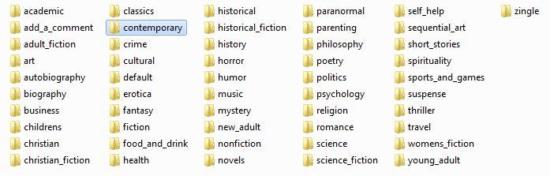

# llopis_scrap.py #

## Description. ##

Ce script à été réalisé dans le cadre d'un projet du parcours 'Développeur d'application - Python' d'OpenClassROoms.

llopis_scrap.py est un outil de scraping utilisable uniquement sur le site [books to scrape](http://books.toscrape.com/), une simulation de librairie en ligne. Il permet de recueillir diverses informations sur les livres, et de les écrire dans un .csv, ainsi que de télécharger les images de couverture des livres.

Pour illustrer, voici le .csv de la catégorie 'Contemporary' contenant 3 livres,\
\
et les diffentes couvertures récupérées.\

\
Pour chacune des catégorie scraper, le script crée un dossier au nom de la catégorie contenant le .csv et le dossier de couverture des livres. Chacun de ces dossiers sont rangés dans le dossier 'output' du répertoire du script (dossier crée par le script si inexsistant).

Voici à quoi ressemble le dossier 'output' après le scrap des 50 catégories du site,\
\
et le dossier contemporary.\

\
Le script affiche sa progression en cours d'éxécution.\

\
**Attention :**
- Le .csv utilise '|' comme séparateur de colonnes.
- Les .csv et la couverture des livres ne sont pas mis à jour en direct.
- Relancer le llopis_scrap.py réécrira le .csv de la catégorie, mais ne retéléchargera pas les couvertures si celles-ci existent déjà. 

## Utilisation ##

Le script s'utilise à partir d'un terminal, de 4 façons différentes.

1. L'option 'book' suivit de l'url d'un livre spécifique, pour recueillir les données d'un seul livre.\
Tous les .csv écrits et les couvertures des livres téléchargées via cette option, sont stockés dans le dossier './output/zingle'\

2. L'option 'category', suivit le l'url de la page '^.index.html' d'une catégorie, pour recueillir les informations de toutes une catégorie.\
 **Attention**, si la catégorie a plusieurs pages, il faut impérativement renseigner la première page qui finit en '/index.html'
 
3. L'option 'all' pour recueillir les données pour tous les livres de toutes les catégorie de livre.

4. L'option input, pour recueillir les données d'une ou plusieurs catégories, via un menu à utiliser dans le terminal. \
\
Via cette option, ont peut sélectionner tous les catégories du site, ou n'en sélectionner que quelques unes.\
Les .csv et couvertures de livres sont stockés au même endroit.\
La sélection se fait par demande d'input à l'utilisateur.

## Installation ##

### Environnement virtuel ###

### Requierements ###

Une fois l'environnement virtuel activé, lancer la commande 'pip install -r requierements.txt' dans le terminal, permet d'installer tous les modules requit pour l'utilisation de llopis_scrap.py.

## À propos ##

### Package ###

llopis_scrap.py utilise un ensemble de modules locals, réunis dans le package scrap_package.

Pour chaque module, une description, sa structure, ses inputs, ses transformations et ses ouputs.

- a_collect_url_home_all_category.py\
\
Ce module sert lors des options 'all' et 'input'. Il récupére les http://category_url/index.html de toutes les catégories de livres présentent sur le site. Cette collecte ce fait depuis l'url de page d'accueil du site.\
    - Input : Une constante 'URL_site', qui sert à vérifier que l'url du site est valide.
    - Transformation : Depuis la page d'accueil du site, récupére tous les href commençant par 'catalogue/category/books/', et les utilise pour reconstruire les url en output.
    - Ouput : Les url des catégories type 'http://category_url/index.html'

- b_selection_category_to_scrap.py\
\
Ce module sert à l'option 'input'. Il permet l'apparition du menu et la sélection des catégories à scraper via des input utilisateur.
    - Input : Les différents choix de l'utilateur, tels que les catégories à scraper ou la demande d'affichage des catégories disponible.
    - Transformation : Diverses gestions d'erreurs, de manipulations d'input, de messages utilisateur etc…
    - Output : Les url des catégories type 'http://category_url/index.html' que l'utilisateur aura choisit.

- c_scrap_books_urls_in_category.py\
\
Ce module sert au option 'category', 'all' et 'input'. Il permet la collecte de toutes les url des livres d'un catégorie.
    - Input : L'url d'une catégorie (type '/index.html')
    - Transformation : Évalue le nombre de pages que possède la catégorie, selon le nombre de livres qu'elle contient. Contruit les url des autres pages de la catégories. Pour chaque page de la catégorie, récupére les href de tout les h3 de la page. Puis reconstruit les urls des livres.
    - Output : Toutes les url des livres de la catégorie donnée en input.

- d_check_url_books.py\
\
Ce module sert dans toutes les options. Il permet de renvoyer un message d'erreur si l'url d'un livre est érronée. Dans notre cas il n'est pas utile, car notre site fictif n'est pas sujet à modification. Mais dans le cas d'un véritable projet, il serait pertinant de ce pencher sur cette fonctionnalité.
    - Input : L'ensemble des url des livres d'une catégorie (ou l'url du livre renseignée avec l'option 'book').
    - Transformation : Fais une requête pour chaque url.
    - Output : L'ensemble des url de livres contenues dans l'input ou un message d'erreur indiquant l' (les) url invalide(s).

- e_scrap_data.py\
\
Ce module sert dans toutes les options. Il récupére l'ensemble des données voulu pour chaque url de livre contenues en input.
    - Input : L'ensemble des url de livres d'une catégorie. (ou l'url du livre renseignée avec l'option 'book') 
    - Transformation : Crée un dictionnaire vide ayant pour keys les données voulues. Pour chaque url, récupére les informations à différents endroit de la page du livre et les stockent dans le dictionnaire.
    - Output : Le dictionnaire contenant toutes les informations désirées, pour l'ensemble des url de livres contenues en input.

- f_write_csv.py\
\
Ce module sert dans toutes les options. Il écrit le .csv, avec pour en-têtes, les keys du dictionnaire, pour séparateur '|' et pour contenu, l'ensemble des informations pour tous les livres d'une catégorie (ou du livre renseignée avec l'option 'book').
    - Input : Dictionnaire d'une catégorie (ou du livre renseignée avec l'option 'book').
    - Transformation : Détermine la catégorie concernée. Si le dossier './output' n'existe pas, le crée. Recconnait si l'on vient depuis l'option 'book', dans ce cas écrit le .csv dans le dossier '.output/zingle/nom_livre_upc.csv', sinon écrit le fichier dans le dossier './output/name_category/data_books_in_name_category_category.csv'. Crée le dossier './output/name_category' s'il n'existe pas.
    - Output : le fichier .csv.

- g_cover_download.py\
\
Ce module sert dans toutes les options. Il télécharge l'image de couverture de tous les livres d'une catégorie (ou du livre erneignée avec l'option 'book').
    - Input : Dictionnaire d'une catégorie (ou du livre renseignée avec l'option 'book')
    - Transformation : Détermine la catégorie concernée. Si le dossier './output/' n'existe pas, le crée. Reconnait si l'on vient depuis l'option 'book', dans ce cas stock l'image dans le dossier './output/zingle/name_book_upc.jpg', sinon les stockent dans le dossier './output/name_category/cover_name_category/'. Limite le nom du chemin à 245 caractère (260 limite par défault de windows, 15 nécessaire au module), tronque dans le nom du livre si besoin.
    - Output : Les images au format 'jpg',  dont l'url est présente dans le dictionnaire en input.

- main_p02_scrap.py\
\
Ce module sert de main pour les 4 options disponible.
    - Input : Pour les options 'book' et 'catégory', l'url renseignée, sinon pas d'input.
    - Transformation : Principalement des appels de fonctions.
    - Output : Le bon enchaînement des modules.

### Bugs connus ###
Indiquer une solution envisagée pour sa réparation

#### Idées d'amélioration (optionnel) ###
Permettre à l'utilisateur de définir le nombre de caractères à utiliser
pour le nom de cover.

