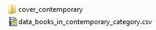
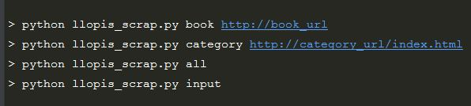

# les tags #

python, openclassrooms (s'il n'existe pas en créer un a l'aide du site),
windows ?, pycharm ?
licence libre

# scrap.py #

## Description. ##

Ce script à été réalisé dans le cadre d'un projet du parcours 'Développeur d'application - Python' d'OpenClassROoms.

scrap.py est un outil de scraping utilisable uniquement sur le site [books to scrape](http://books.toscrape.com/), une simulation de librairie en ligne. Il permet de recueillir diverses informations sur les livres, et de les écrire dans un .csv, ainsi que de télécharger les images de couverture des livres.

Pour illustrer, voici le .csv de la catégorie 'Contemporary' contenant 3 livres,

et les diffentes couvertures récupérées.

Pour chaqu'une des catégorie scraper, le script crée un dossier au nom de la catégorie contenant le .csv et le dossier de couverture des livres. Chaqu'un de ces dossiers sont rangés dans le dossier 'output' du répertoire du script (dossier crée par le script si inexsistant).

Voici à quoi ressemble le dossier 'output' après le scrap des 50 catégories du site,

et le dossier contemporary.

Les .csv et la couverture des livres ne sont pas mis à jour en direct.\
Relancer le script réécrira le .csv de la catégorie, mais ne retéléchargera pas les couvertures si celles-ci existent déjà. 

## Utilisation ##

Le script s'utilise à partir d'un terminal, de 4 façons différentes.

1. L'option 'book' suivit de l'url d'un livre spécifique, pour recueillir les données d'un seul livre.\
Tous les .csv écrits et les couvertures des livres téléchargées via cette option, sont stockés dans le dossier './output/zingle'\

2. 
3. 
4. 

### Requierements

### Package
Pour chaqu'un des élèments du package
description
    entrée transformation sortie
structure

### Bugs connus
Indiquer une solution envisagée pour sa réparation

#### Idées d'amélioration (optionnel)
Permettre à l'utilisateur de définir le nombre de caractères à utiliser
pour le nom de cover.

